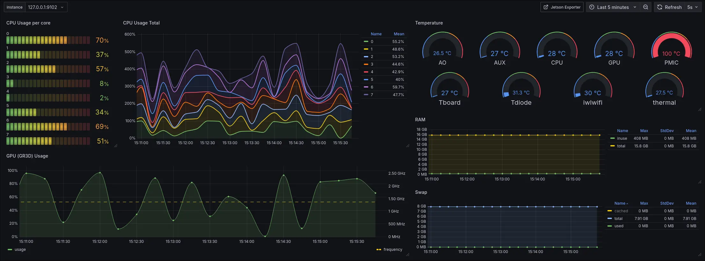

Jetson Exporter
===============

<div align="flex">
    
</div>

[](https://goreportcard.com/report/github.com/GDWR/jetson-exporter)
[](https://github.com/GDWR/jetson_exporter/releases)
[](https://github.com/GDWR/jetson_exporter/blob/main/LICENSE)

Prometheus exporter for the Nvidia Jetson family.

Supported devices:
- Jetson Orin

## Install

```shell
# Download the latest release
wget https://github.com/GDWR/jetson-exporter/releases/download/v0.0.1/jetson-exporter_0.0.1_arm64.deb
# Install the package
sudo dpkg -i jetson-exporter_0.0.1_arm64.deb
# Clean up
rm jetson-exporter_0.0.1_arm64.deb
```

## Grafana (dashboards) + Prometheus Example

Find a basic configuration of Prometheus + Grafana that can be used to monitor a Jetson device (on the same system). 
This configuration is available in the [`example`](./example) directory.

A Grafana dashboard is available in the [`example/grafana/dashboards`](./example/grafana/dashboards) directory.

> [!NOTE]
> If you notice an issue with the grafana dashboard, please open an issue or submit a pull request.




## Contributing

Find a bug? Want to add a feature? Submit a pull request or open an issue. All contributions are welcome!
This repository has a configured [`.devcontainer`](https://code.visualstudio.com/docs/devcontainers/tutorial) for use with Visual Studio Code to make it easy to get involved.

In the scripts directory, a useful `tegrastats` emulator script from the [jetson_stats](https://github.com/rbonghi/jetson_stats) has been added
as a good means of testing your changes (until formal unit tests are added). To utilize this script use the command
```shell
go run cmd/jetson_exporter.go --tegrastats.path $PWD/scripts/tegrastats
```

Resources
---------
* [`tegrastats` Utility](https://docs.nvidia.com/drive/drive-os-5.2.0.0L/drive-os/index.html#page/DRIVE_OS_Linux_SDK_Development_Guide/Utilities/util_tegrastats.html)
* [jetson_stats](https://github.com/rbonghi/jetson_stats)
* [ridgerun's Evaluating Performance docs using `tegrastats`](https://developer.ridgerun.com/wiki/index.php/Xavier/JetPack_5.0.2/Performance_Tuning/Evaluating_Performance)
* [Repository Structure](https://github.com/golang-standards/project-layout)
